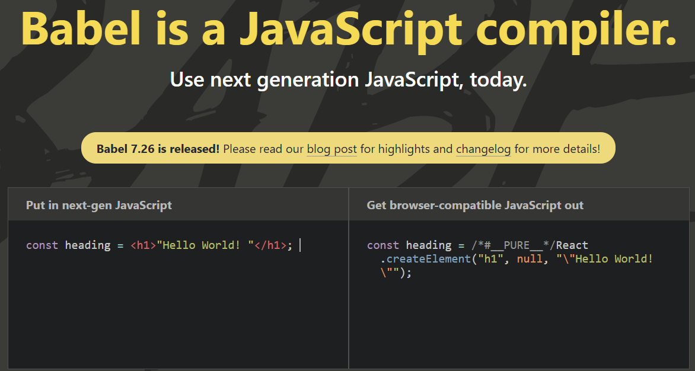

# NamasteReact
### Akshay is a great teacher ! Much Much thanks to his clear concepts.


## Table of Contents

| No. | Questions                                                                                       |
| --- | ------------------------------------------------------------------------------------------------| 
| 1 | [](#)                                                                                             |
| 2 | [](#)                                                                                             |
| 3 | [](#)                                                                                             |
| 4 | [](#)                                                                                             |
| 5 | [](#)                                                                                             |
| 7 | [](#)                                                                                             |
| 8 | [](#)                                                                                             |
| 9 | [](#)                                                                                             |
| 10 | [](#)                                                                                            |


## What's the easiest framework to Migrate existing Javascript project ?
React is easiest to migrate existing JS project, because you can also simply import CDN and work on the same js file.
While other frameworks require to create a complete project structure then start.


## How to make a JS project React project?
Import React CDN to your index.html
```html
<script crossorigin src="https://unpkg.com/react@18/umd/react.development.js"></script>
<script crossorigin src="https://unpkg.com/react-dom@18/umd/react-dom.development.js"></script>
```

### What is CDN?


### What is CrossOrigin?


### Why these two links for CDN? Why not only one ?
* React works on Browsers as well as Mobile phones. React for Browsers, React Native, React 3D.
* File #1 is pure react code
* File #2 is bridge between React & Browsers to connect to DOM


## How would you render React from index.html?
```html
    <div id="root">Hello World form HTML !</div>
    <script crossorigin src="https://unpkg.com/react@18/umd/react.development.js"></script>
    <script crossorigin src="https://unpkg.com/react-dom@18/umd/react-dom.development.js"></script>
    <script>
        const heading = React.createElement("h1", {}, "Hello World from REACT !");

        const root = ReactDOM.createRoot(document.getElementById('root'));

        root.render(heading);
    </script>
```

1. You want to expose here <div id="root"></div>
2. Imported React CDNs
3. create an h1 element using React 
4. create root using ReactDOM
5. render the html element(step3) you have created to root(step4)
    * rendering replaces whatever is inside root div tag


## What is React Element?
React Element is an object understandable by Browser.


## Create a React element for following nested div

Eg 1.
```html
<div id='parent'>
    <div id='child'>
        <h1>Hello World!</h1>
    </div>
</div>
```

```javascript
const parent = 
    React.createElement(
        "div",{id: "parent"}, 
        React.createElement(
            "div", {id: "child"},
            React.createElement(
                "h1", {}, "Hello World!"
            )
        )
    );
```

Eg 2.  
```html
<div id='parent'>
    <div id='child'>
        <h1>Hello World!</h1>
        <h2>How are you!</h2>
    </div>
</div>
```

```javascript
const parent = 
    React.createElement(
        "div",{id: "parent"}, 
        React.createElement(
            "div", {id: "child"},
            [
                React.createElement("h1", { }, "Hello World!"),
                React.createElement("h2", { }, "How are you!"),
            ]
        )
    );
```

## What is package.json
It serves as the configuration file for your project, managing metadata, dependencies, scripts, and other settings.

* package.json is a configuration for npm
* devDependencies: Lists tools and packages needed only for development (e.g., testing libraries, bundlers).
* dependencies: Lists the libraries and packages required for the project to run.
* peerDependencies: Lists packages that your package expects to work alongside.
* optionalDependencies: Dependencies that are optional for the project.


## Why do we install Parcel ?

npm install parcel

Parcel is a zero-config bundler for web applications. It helps bundle all your project's assets (JavaScript, CSS, HTML, images, etc.) into optimized files for production. 
* Zero configuration needed for most projects.
* Fast bundling with caching and parallelization.
* Built-in support for modern JavaScript and TypeScript.
* Support for Hot Module Replacement (HMR) during development.
* It has File watching Algorithm- Written in C++
* Faster build- Because it is caching under .parcel-cache, so reusing the cache.
* Image Optimization
* Minification
* Bundling
* Compressing
* Consistent Hashing 
* Code Splitting
* Differential Bundling - support older browsers 
* Error Handling
* HTTPS 
* Tree shaking- remove unused code for you.
Read parcel.js documentation.


## what is ~ or ^ before a node package version like "react": "^18.0.0" ?
1. Caret (^)
* Allows updates to the latest minor version.
* Example: "react": "^18.0.0"
    * Matches: 18.0.1, 18.1.0, 18.2.3
    * Does NOT match: 19.0.0 (major version change)

2. Tilde (~)
* Allows updates to the latest patch version.
* Example: "react": "~18.0.0"
    * Matches: 18.0.1, 18.0.5
    * Does NOT match: 18.1.0 or 19.0.0

3. No Symbol
* Specifies an exact version.
    * Example: "react": "18.0.0"
    * Matches only 18.0.0.


**Semantic Versioning (SemVer)**
Most Node.js packages follow Semantic Versioning (MAJOR.MINOR.PATCH):
* MAJOR: Breaking changes.
* MINOR: Backward-compatible new features.
* PATCH: Bug fixes and small improvements.


## What is package-lock.json?
* package.json has approximate versions ~ or ^ 
while package-lock.json keeps a track of exact version of all packages in package-lock.json

* integrity : "hash"
It keeps a track of exact hash


## npm vs npx
* npm contains packages to be installed 
* npx executes 


### What is JSX ?
JSX is HTML-like or XML-like syntax to replace React elements

For eg.
React.createElement("h1", {id: "heading"}, "Hello World !"),

can be written as
<h1 id=heading>Hello World !</h1>


### What is babel?
Babel is in Parcel
babel converts a JSX declaration into React.createElement
It's an opensource Javascript compiler.

<div>
<p align="center">
    
</p>
</div>
